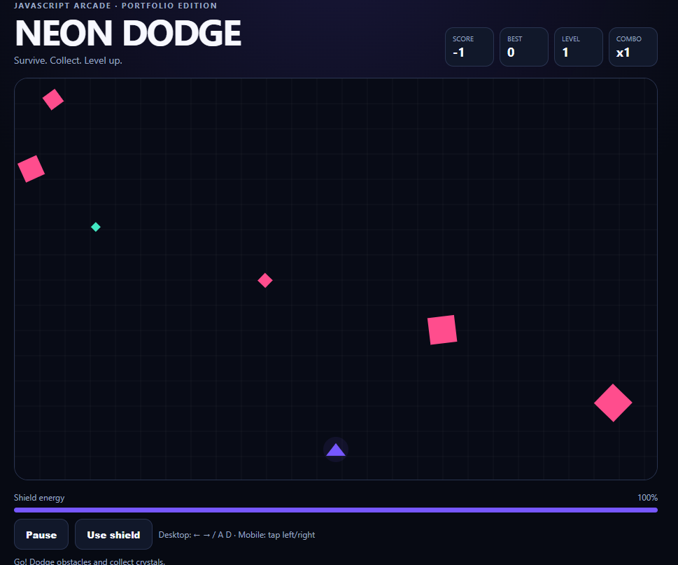

# 🎮 Neon Dodge

> A fast-paced browser arcade game built with vanilla JavaScript.

Neon Dodge is a minimalist arcade game where the goal is simple:

**survive, dodge obstacles, collect crystals and beat your high score.**

The project was created as a portfolio project to practice modern front-end fundamentals, game loops, canvas rendering and interactive UI.

---

## 🎮 Play the Game

### 🌐 Live Demo

**[Play Neon Dodge](https://MariB3195.github.io/neon-dodge/)**

The game is published online using GitHub Pages.

### 💻 Run Locally

You can also run the game directly on your computer.

Open `index.html` with Google Chrome, Firefox, Edge or another modern browser.

---

## ✨ Features

* 🎮 Real-time arcade gameplay
* ⚡ Progressive difficulty
* 📈 Multiple levels
* 💎 Collectible crystals
* 🔥 Combo multiplier
* 🛡️ Shield energy system
* ✨ Particle effects
* 🏆 Persistent high score
* 💾 LocalStorage support
* 📱 Responsive layout
* 👆 Mobile touch controls
* ⌨️ Keyboard controls
* ⏸️ Pause / resume
* ♿ Reduced-motion support

---

## 🕹️ Controls

### Desktop

| Key     | Action          |
| ------- | --------------- |
| `←`     | Move left       |
| `→`     | Move right      |
| `A`     | Move left       |
| `D`     | Move right      |
| `Space` | Pause / resume  |
| `Shift` | Activate shield |

### Mobile

Tap or hold the **left or right side** of the game area to move.

---

## 🧠 Technologies

This project was built without external frameworks or libraries.

### Frontend

* HTML5
* CSS3
* JavaScript ES6+
* Canvas API

### Browser APIs

* `requestAnimationFrame`
* `localStorage`
* Pointer Events
* Keyboard Events

---

## 📁 Project Structure

```text
neon-dodge/
│
├── index.html
├── style.css
├── game.js
├── README.md
├── LICENSE
├── CONTRIBUTING.md
├── CHANGELOG.md
├── .gitignore
│
└── assets/
    └── .gitkeep
```

---

## 🎯 Gameplay

The player controls a small neon ship at the bottom of the screen.

Obstacles continuously fall from above.

The longer you survive:

* the score increases
* the level increases
* obstacles become faster
* the game becomes more challenging

Crystals provide bonus points and increase the combo multiplier.

The shield can absorb incoming obstacles, but it consumes energy.

---

## 💎 Scoring System

Different actions reward different amounts of points.

### Surviving

The player continuously earns points while playing.

### Collecting crystals

Crystals give bonus points based on the current combo.

### Shield collisions

Destroying an obstacle with the shield also rewards points.

### Combo

Collecting multiple crystals increases the multiplier:

```text
x1 → x2 → x3 → ... → x9
```

---

## 🛡️ Shield System

The shield is one of the main strategic mechanics.

Players can activate it when their energy is available.

While active:

* collisions with obstacles are blocked
* particles are generated
* shield energy decreases over time

Crystals also restore shield energy.

---

## 📈 Progressive Difficulty

The game becomes harder as the player's score increases.

Every level increases the challenge by:

* increasing obstacle speed
* increasing spawn frequency
* increasing overall pressure on the player

This creates an endless arcade-style progression system.

---

## 💾 High Score

The best score is stored using the browser's `localStorage`.

This means the player's record remains available even after refreshing the page.

Example:

```javascript
localStorage.setItem(
  "neonDodgeBest",
  String(bestScore)
);
```

---

## 🎨 Design

The interface uses a dark neon-inspired visual style.

Main design principles:

* minimal UI
* high contrast
* responsive layout
* clear game statistics
* accessible controls
* lightweight rendering

---

## 📱 Responsive Design

Neon Dodge works on:

* 💻 Desktop
* 💻 Laptop
* 📱 Mobile
* 📱 Tablet

The game uses responsive CSS and Pointer Events for mobile interaction.

---

## ♿ Accessibility

The project includes several accessibility considerations:

* semantic HTML
* accessible labels
* keyboard controls
* visible focus states
* live status messages
* reduced-motion support

---

## 🚀 Running Locally

No dependencies are required.

Clone the repository:

```bash
git clone https://github.com/MariB3195/neon-dodge.git
```

Enter the project directory:

```bash
cd neon-dodge
```

Then open:

```text
index.html
```

in your browser.

Alternatively, you can run a simple local server:

```bash
python -m http.server 8000
```

Then visit:

```text
http://localhost:8000
```

---

## 🔮 Future Improvements

Possible future versions could include:

* 🔊 Sound effects
* 🎵 Background music
* 🏆 Online leaderboard
* 👾 More enemy types
* ⚡ Additional power-ups
* 🚀 Different ships
* 🎨 Unlockable skins
* 🎚️ Difficulty modes
* 📲 Progressive Web App support
* 🧪 Automated tests
* 🌐 Online statistics

---

## 📸 Screenshots

Add a screenshot or gameplay GIF here after creating one:

```md

```

---

## 🌐 Live Demo

🎮 **[Play Neon Dodge](https://MariB3195.github.io/neon-dodge/)**

---

## 📄 License

This project is licensed under the MIT License.

See the `LICENSE` file for details.

---

## 👨‍💻 Author

Created as a portfolio project to explore:

* Front-end development
* JavaScript game development
* Canvas rendering
* Interactive UI
* Responsive web design

---

⭐ If you like the project, consider giving the repository a star!
